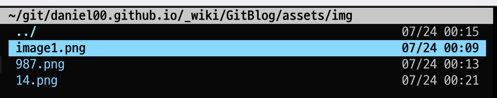

## 마크다운 파일에 이미지 넣는법에 대해 설명합니다.
[johngrib]( http://johngrib.github.io ) 님은 Github Repository에 Issue를 생성해서 이미지를 넣는 방법을 사용한다고 한다.  
나는 [img-paste.vim](https://github.com/img-paste-devs/img-paste.vim) 플러그인을 활용하는 방법을 택했다.  
이유는, 이미지를 클립보드에 캡처한 후 붙여넣으면 되므로 이미지 붙여넣기가 좀더 수훨 한 듯 하고, 깃헙에 접속하지 않아도 되기 때문이다.  


다음의 순서로 이미지를 넣을 수 있다.  
  * [img-paste.vim](https://github.com/img-paste-devs/img-paste.vim) 을 설치하고
  * .vimrc에 다음과 같이 설정한다.

  ```vim
  " for img-paste.vim
  autocmd FileType markdown nmap <buffer><silent> <leader>p :call mdip#MarkdownClipboardImage()<CR>
  autocmd FileType markdown let g:PasteImageFunction = 'g:MarkdownPasteImage'
  let g:mdip_imgdir = "/assets/img"
  let g:mdip_imgname = 'image'

  ```
  나는 이미지를 .md 파일이 위치하고 있는 디렉토리에 assets/img 디렉토리를 만든다음 저장하도록 설정했다.  
  * 이미지를 클립보드에 캡처하고  
  * vim 명령모드에서 :MarkdownPasteImage를 누르면, 저장할 이름을 물어본다. 적당한 이름을 입력하고 엔터를 치면 이미지가 저장되고,
  다음처럼 경로가 자동 입력된다.
  그러면 이미지가 설정된 경로에 저장된다.
  
 
 근데, img-paste.vim 에 설정한 경로 /assets/img 를 jekyll에서 찾을 수 있도록 경로 앞에 `점을` 두개 찍어주어야 한다.  
 `../assets/img`  
 실제 적용된 이미지 삽입 코드는 다음과 같다.
 
 ```md
  
 ```  
깃헙에 푸쉬해서 온라인에서도 이미지가 정상적으로 표시되는걸 확인했다.
  
이미지는 파일로 추가되므로, 항상 git add, git commit를 수행해 주어야 한다.  


 
<!-- ## 여긴 연습하는 영역입니다 -->    
<!-- ```txt -->
<!-- txt를 코드영역에 넣어봤습니다. --> 
<!-- 이렇게 표시 됩니다. -->
<!-- ``` -->
<!-- 키보드에 대하여 -->  
<!-- 로우 프로파일 키보드는 입력이 어렵다. -->  
<!-- 그래서 어떻게 할 까 고민 중이다. -->
<!-- 백스페이스는 어떤걸 사용하는게 좋을까? -->  

<!-- 나는 컨트롤키와 알파벳 O를 사용한다. -->
<!-- 익숙해지면 쉽다. -->
<!-- 한글만 입력하는것도 좀 어렵다. -->


<!-- 이렇게 높은 키프로파일이 나한테는 어울린다. -->
<!-- 구분감이 확실히 있어서 뭔가 타자 치는 맛이 난다. -->

<!-- `한글도` 마크다운으로 강조가 되는지 확인해 보자. -->

<!-- 확실히 확실히 스플릿 키보드가 훨씬 더 편하다. -->
<!-- 일반 키보드는 항상 팔에 긴장감이 있다. -->

<!-- 키크론도 좋긴한데 가격이 너무 비싸다. -->

<!-- 어떤 키보드를 쓰는게 좋을지 고민이다. -->

<!-- 스플릿 키보드가 좋긴한데 무선을 찾기가 힘들고, --> 
<!-- 가격이 너무 비싸다. -->
<!-- 멤브레인은 무선 + 텐키리스 조합이 없다. --> 
<!-- 무선 스플릿은 가격이 비싸다. freestyle 등 -->

<!-- 알리에서 alice, crone 등을 알아보고 있다. --> 
<!-- 근데... -->
<!-- 조금 편하자고 스플릿을 쓰는게 맞는건지도 약간은 고민이다. -->

<!-- 펜타그레프도 익숙해지면 좋아지려나? -->
<!-- 맥북 키보드가 제법 느낌도 좋고 괜찮은 편이다. -->

<!-- koolertron 키보드가 흑축키를 사용하는데, 소음이 어느정도 인지 확인해보고 -->
<!-- 회사에서 사용할지 말지 결정하자. -->
