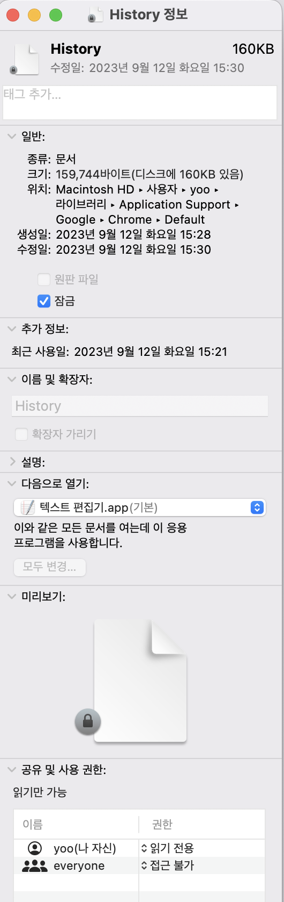

## 크롬에서 검색기록을 남기지 않는 방법에 대해 설명합니다.

크롬에서 구글 페이지를 열면 내가 검색한 기록이 드롭다운 형태로 보여진다.
이건 인터넷 기록, 쿠키 등을 삭제해도 여전히 남아있다.

해결 방법은, 크롬이 관리하는 History 파일의 내용을 삭제하고 읽기전용, 잠금 등으로 처리하여,
크롬이 검색기록을 저장하지 못하게 하면된다.

### History 파일 경로
  ~/Library/Application Support/Google/Chrome/Default/History

