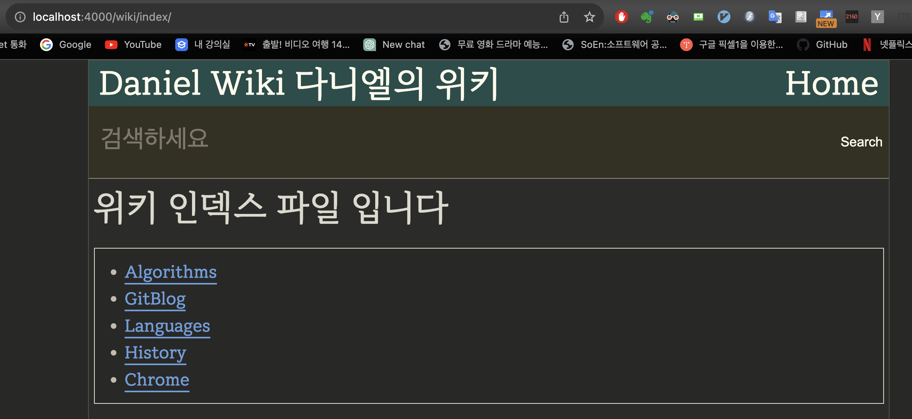
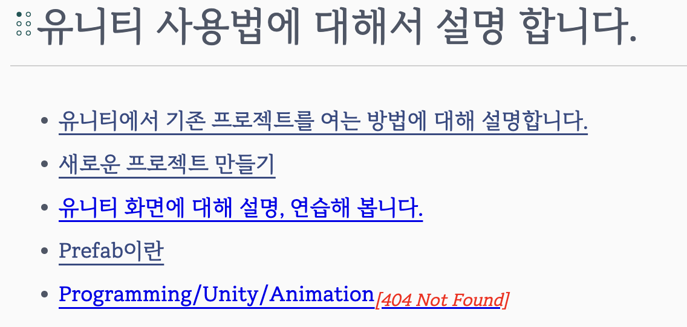

## Jekyll 사용법에 대해 설명합니다.

## Jekyll 설치 방법


## Jekyll 실행 방법
wiki의 루트 디렉토리에서 다음의 명령을 실행하면,  소스코드가 바뀔때 마다 브라우저에 자동 업데이트 된다.  
```
sudo bundle exec jekyll serve --livereload  
```    

yoo@MacForYoo git/daniel00.github.io (master) » bundle exec jekyll serve --livereload  


## 로컬에서 확인하는 방법
브라우저에서 http://localhost:4000 주소를 연다.  



<!-- *** -->  
<!-- 중요! 내용이 추가되면 반드시 "개행"을 시켜야 로컬호스트 뷰에 반영이 된다!!!!!! -->
<!-- *** -->  

<!-- 아래처럼 리스트에 Prefab링크를 추가하였으나 로컬뷰에는 업데이트가 되지 않는다. -->

<!-- 코드에 리스트를 추가 하였다. -->
<!--  -->

<!-- 그런데 로컬뷰에는 반영되지 않는다. -->
<!--  -->

## 파일 또는 이미지가 추가되면 반드시 개행! git add, git commit를 해주어야 한다.
링크가 추가되면 반드시 개행해야 업데이트가 된다.(줄끝에 "\<br\>" 또는 스페이스 두개)  

파일이 추가되었으나 commit 되지 않아서 404 Not Found라는 문구가 표시된다.



git add, git commit 후에 정상적으로 표시된다.


## no accepter 에러 발생시 해결방법
jekyll을 kill 한 후 재시작 한다.
ps 로 프로세스 아이디를 찾아서 kill 한다.

```
ps -aux | grep jekyll
```

```
kill -9 프로세스ID
```

그리고 jekyll을 재시작 한다.  
```
bundle exec jekyll serve --livereload  
```    
커맨드를 실행하는 경로에 유의해야 한다.
github.io루트 디렉토리에서 실행해야 한다!!!


