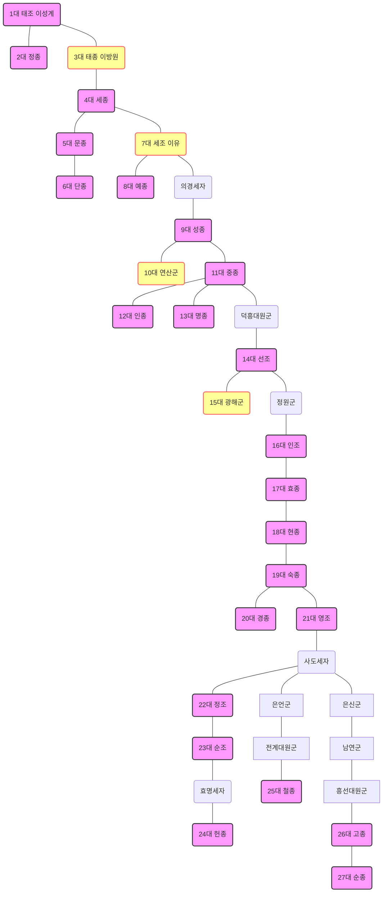

created: 2026-02-22 23:32:31 Sun
updated: 2026-02-22 23:32:31 Sun

####  조선왕 정리

| 대수  | 묘호      | 본명(휘) | 재위 기간     | 핵심 업적 및 특징                | 수명(만) |
| :-- | :------ | :---- | :-------- | :------------------------ | :---- |
| 1   | **태조**  | 이성계   | 1392~1398 | 조선 건국, 한양 천도              | 72세   |
| 2   | **정종**  | 이방과   | 1398~1400 | 제2차 왕자의 난 후 즉위, 개경 환도     | 62세   |
| 3   | **태종**  | 이방원   | 1400~1418 | **왕권 강화**, 사병 혁파, 6조 직계제  | 55세   |
| 4   | **세종**  | 이도    | 1418~1450 | **훈민정음 창제**, 4군 6진, 과학 발전 | 53세   |
| 5   | **문종**  | 이향    | 1450~1452 | 측우기 제작 참여, 유교 정치 지향       | 37세   |
| 6   | **단종**  | 이홍위   | 1452~1455 | 어린 나이에 즉위, 세조에 의해 폐위      | 16세   |
| 7   | **세조**  | 이유    | 1455~1468 | 계유정난 집권, 직전법, 경국대전 시작     | 51세   |
| 8   | **예종**  | 이황    | 1468~1469 | 남이의 역모 사건, 경국대전 완성        | 19세   |
| 9   | **성종**  | 이혈    | 1469~1494 | **경국대전 반포**, 홍문관 설치       | 37세   |
| 10  | **연산군** | 이융    | 1494~1506 | 무오·갑자사화, 중종반정 폐위          | 30세   |
| 11  | **중종**  | 이역    | 1506~1544 | 조광조 개혁 시도, 기묘사화           | 56세   |
| 12  | **인종**  | 이호    | 1544~1545 | 조선 최단기 재위 (9개월)           | 30세   |
| 13  | **명종**  | 이환    | 1545~1567 | 을사사화, 외척(윤원형) 득세, 임꺽정     | 33세   |
| 14  | **선조**  | 이연    | 1567~1608 | **임진왜란**, 붕당 정치 시작        | 55세   |
| 15  | **광해군** | 이혼    | 1608~1623 | 중립 외교, 대동법 시행, 인조반정 폐위    | 66세   |
| 16  | **인조**  | 이종    | 1623~1649 | 정묘·병자호란 (삼전도의 굴욕)         | 53세   |
| 17  | **효종**  | 이호    | 1649~1659 | 북벌 계획 추진, 군비 확충           | 40세   |
| 18  | **현종**  | 이연    | 1659~1674 | 예송 논쟁 (복제 문제 대립)          | 33세   |
| 19  | **숙종**  | 이순    | 1674~1720 | 환국 정치, **대동법 전국 확대**      | 59세   |
| 20  | **경종**  | 이윤    | 1720~1724 | 신임사화, 소론·노론 대립            | 35세   |
| 21  | **영조**  | 이 금   | 1724~1776 | **탕평책**, 균역법, **최장수 재위**  | 81세   |
| 22  | **정조**  | 이 산   | 1776~1800 | 규장각, 장용영, 수원 화성 축조        | 47세   |
| 23  | **순조**  | 이 공   | 1800~1834 | 세도 정치 시작, 홍경래의 난          | 44세   |
| 24  | **헌종**  | 이 환   | 1834~1849 | 세도 정치 지속, 천주교 박해          | 21세   |
| 25  | **철종**  | 이 변   | 1849~1863 | 삼정의 문란, 임술농민봉기            | 32세   |
| 26  | **고종**  | 이 희   | 1863~1907 | 대원군 섭정, 개항, **대한제국 선포**   | 66세   |
| 27  | **순종**  | 이 척   | 1907~1910 | 대한제국 마지막 황제, 국권 피탈        | 52세   |

